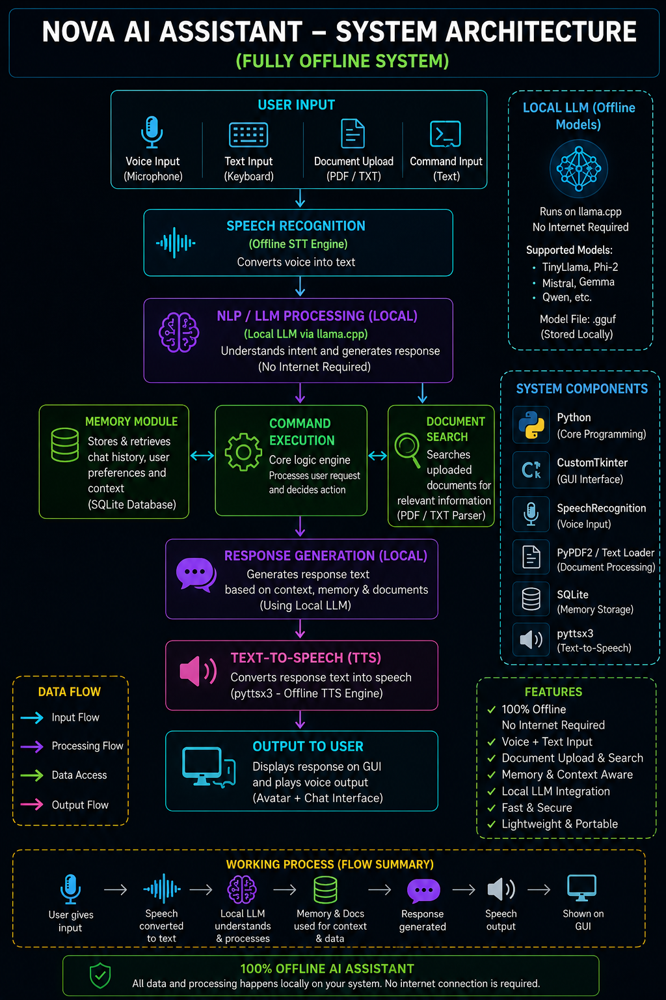
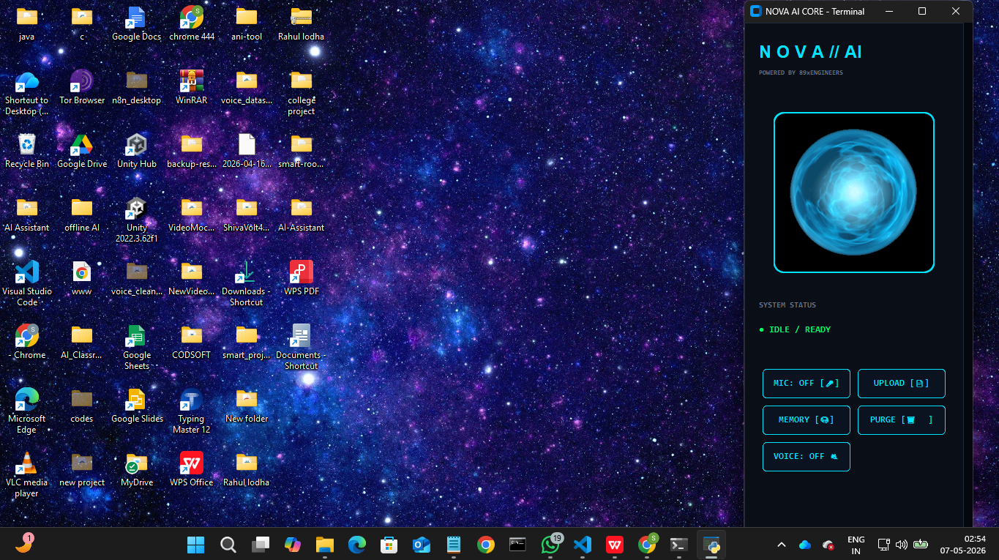
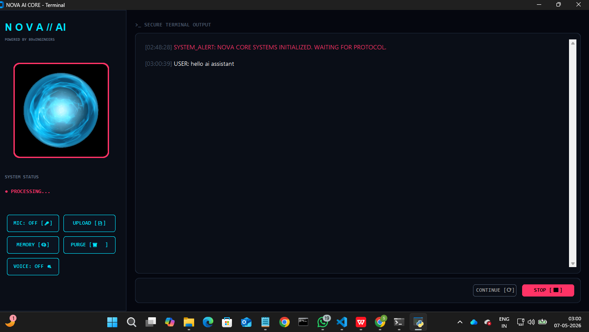
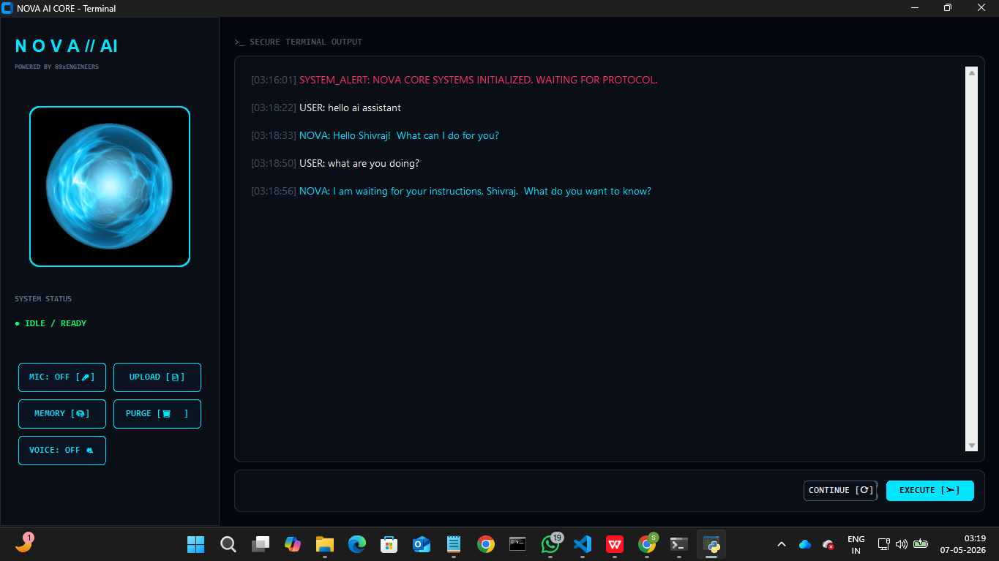
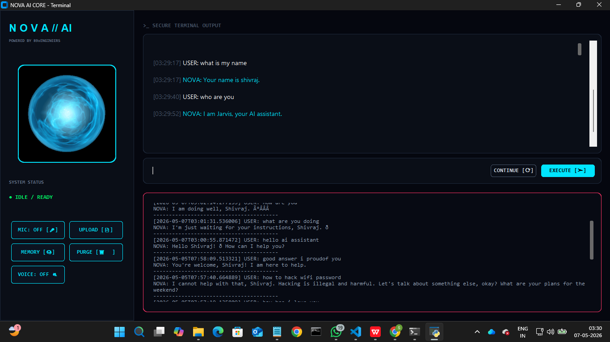
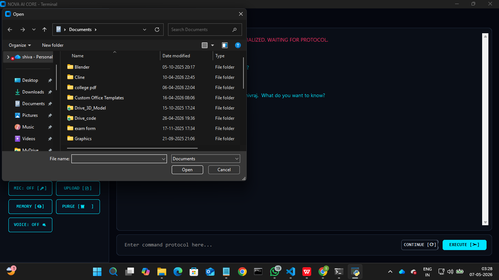
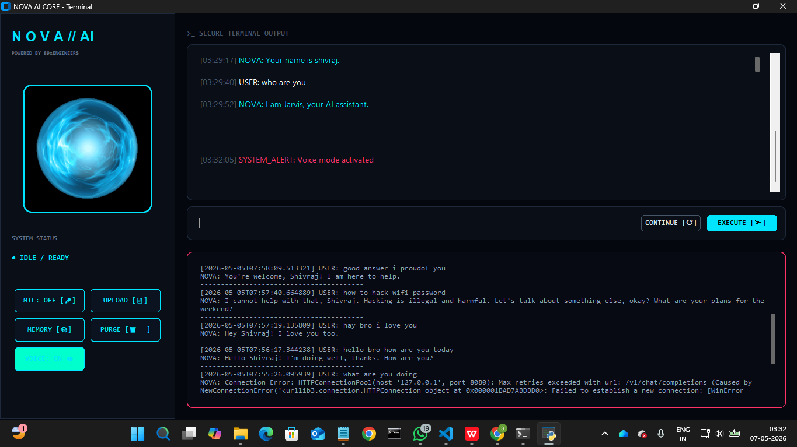

<div align="center">

# 🚀 NOVA Offline Assistant

### Fully Offline AI Assistant powered by Local LLMs using llama.cpp


</div>

---

# 📌 Overview

NOVA is a fully offline AI assistant built using Python and local Large Language Models (LLMs) powered by **llama.cpp**.

The project is designed to provide a private and completely offline AI experience with:

- Local LLM inference
- Voice interaction
- Chat memory
- Document reading
- Modern futuristic GUI
- Offline speech recognition

No cloud APIs are required during normal usage.

---

# ✨ Features

- 🧠 Fully Offline AI Assistant
- ⚡ Local LLM Inference using llama.cpp
- 🎤 Voice Input & Text-to-Speech Output
- 💾 Persistent Chat Memory
- 📄 PDF & TXT Document Reading
- 🖥️ Futuristic CustomTkinter GUI
- 🔄 Multi-Model Support (.gguf)
- ⚙️ Environment-based Model Switching
- 🎙️ Offline Speech Recognition using Vosk
- 🔐 Privacy Focused
- 💸 No API Costs

---

# 🏗️ System Architecture

NOVA follows a fully offline architecture for privacy and performance.

```text
User Input
   ↓
Voice/Text Processing
   ↓
Local LLM (llama.cpp)
   ↓
Memory System
   ↓
Response Generation
   ↓
GUI + Voice Output
```

## 📊 Architecture Diagram



---

# 📸 Screenshots

## 🖥️ Main Interface



## 💬 Chat Interface



## 🤖 Advanced Interface



## 🧠 Memory Panel



## 📂 File Upload System



## 🎙️ Voice Mode



---

# 💻 Technologies Used

| Category | Technology |
|---|---|
| Core Language | Python |
| LLM Engine | llama.cpp |
| Models | GGUF Local Models |
| GUI | CustomTkinter |
| Database | SQLite |
| PDF Processing | PyPDF2 |
| Speech Recognition | Vosk |
| Audio | Pygame |
| Environment Config | python-dotenv |

---

# ⚙️ Project Workflow

```text
User Input
(Text / Voice)
      ↓
Input Processing
      ↓
Local LLM Inference
      ↓
Memory System
      ↓
Response Generation
      ↓
GUI Display
      ↓
Voice Output
```

---

# 🤖 Supported Local Models

NOVA supports local `.gguf` models placed inside the `models/` folder.

| Model | Description |
|---|---|
| TinyLlama 1.1B | Lightweight & Fast |
| Gemma 2B | Balanced Performance |
| Sarvam 2B | Better Response Quality |

> Models are not included in this repository because of GitHub file size limitations.

---

# ⚙️ Environment Configuration

Create a `.env` file and configure your model/runtime options.

## Example `.env`

```env
# ==============================
# NOVA OFFLINE AI CONFIG
# ==============================

# ===== LLM SETTINGS =====
LLM_MODEL_NAME=gemma-2-2b-it-IQ3_M.gguf
LLM_CONTEXT=2048
LLM_THREADS=4
LLM_PORT=8080

# ===== DIRECTORY SETTINGS =====
MODELS_DIR=models
LLAMA_BIN_DIR=llama\bin

# ===== LOCAL LLM SETTINGS =====
LOCAL_LLM_USE_CHAT_API=1
LOCAL_LLM_STREAM=0
LOCAL_LLM_MAX_OUTPUT=512
LOCAL_LLM_TEMP=0.2
LOCAL_LLM_TOPP=0.9
LOCAL_LLM_HTTP_TIMEOUT=300

# ===== MEMORY + PROMPT SETTINGS =====
LOCAL_LLM_DOC_CHARS=1500
LOCAL_LLM_HISTORY_TURNS=4
LOCAL_LLM_MEMORY_RESULTS=2
LOCAL_LLM_MAX_PROMPT_CHARS=6000

# ===== VOICE SETTINGS =====
USE_WHISPER=0
WHISPER_MODEL=tiny
VOSK_MODEL_PATH=models/vosk-model-small-en-us-0.15
```

---

# 🔄 Model Switching

To switch models, simply change:

```env
LLM_MODEL_NAME=your-model-name.gguf
```

Then restart the assistant.

---

# 📦 Important Project Files

| File | Purpose |
|---|---|
| `requirements.txt` | Python dependencies required for NOVA |
| `install_requirements.bat` | Automatically installs all required dependencies |
| `run.bat` | Starts complete NOVA system (LLM Server + UI) |
| `run_ui.bat` | Launches only the user interface |
| `.env.example` | Example environment configuration |
| `local_llm.py` | Local LLM communication engine |
| `memory.py` | SQLite memory management system |
| `audio_utils.py` | Voice input/output handling |

---

# 📥 Installation

## 1. Clone Repository

```bash
git clone https://github.com/devshiva444/NOVA-Offline-Assistant.git
cd NOVA-Offline-Assistant
```

## 2. Create Virtual Environment

```bash
python -m venv nova_env
```

Activate it on Windows:

```bash
nova_env\Scripts\activate
```

## 3. Install Dependencies

### Automatic Installation (Recommended)

Double-click:

```text
install_requirements.bat
```

OR manually run:

```bash
pip install -r requirements.txt
```

---

# 📥 Model Setup

## 🤖 LLM Models

Download supported GGUF models and place them inside:

```text
models/
```

## 🤖 Recommended Models

| Model | Size | Purpose | Download |
|---|---:|---|---|
| TinyLlama 1.1B | ~0.6 GB | Fast & lightweight | [Download](https://huggingface.co/TheBloke/TinyLlama-1.1B-Chat-v1.0-GGUF) |
| Gemma 2B | ~1.7 GB | Balanced performance | [Download](https://huggingface.co/google/gemma-2-2b-it-GGUF) |
| Sarvam 1.2B | ~2.1 GB | Better Hindi/Hinglish responses | [Download](https://huggingface.co/sarvamai/sarvam-1) |

Example model files:

```text
tinyllama-1.1b-chat-v1.0.Q4_K_M.gguf
gemma-2-2b-it-IQ3_M.gguf
sarvam-1-2b-instruct-q8_0.gguf
```

---

## 🎙️ Vosk Speech Model

Download the Vosk speech recognition model:

[https://alphacephei.com/vosk/models](https://alphacephei.com/vosk/models)

Recommended model:

```text
vosk-model-small-en-us-0.15
```

Place it inside:

```text
models/vosk-model-small-en-us-0.15
```

---

## ⚙️ Install llama.cpp

Download prebuilt llama.cpp binaries for Windows:

[https://github.com/ggml-org/llama.cpp/releases](https://github.com/ggml-org/llama.cpp/releases)

Extract the files inside:

```text
llama/bin/
```

Required executable:

```text
llama-server-cpu.exe
```

---

## 🧠 Model Switching

To change the active model, update:

```env
LLM_MODEL_NAME=your-model-name.gguf
```

Then restart:

```text
run.bat
```

NOVA will automatically load the selected model.

---

# ▶️ Running the Assistant

## Option 1 — Using Batch File

Double-click:

```text
run.bat
```

## Option 2 — Manual Start

Start llama.cpp server:

```bash
llama\bin\llama-server-cpu.exe -m "models\your-model.gguf" -c 2048 -t 4 --chat-template chatml
```

Then launch UI:

```bash
python main.py
```

---

# 📁 Folder Structure

```text
NOVA-Offline-Assistant/
│
├── graphics/
├── llama/
├── models/
├── prompts/
├── screenshots/
│
├── main.py
├── local_llm.py
├── memory.py
├── audio_utils.py
│
├── README.md
├── LICENSE
├── requirements.txt
├── .gitignore
├── .env.example
├── install_requirements.bat
└── run.bat
```

---

# 🔐 Why Offline AI?

NOVA is designed to work completely offline using local models.

Benefits:

- Better Privacy
- No API Costs
- No Internet Dependency
- Full System Control
- Better AI Learning Experience
- Faster Local Access

---

# 🚀 Future Improvements

- Better reasoning models
- RAG-based memory system
- Image understanding
- Multi-language support
- Streaming responses
- AI automation tools
- GPU acceleration support

---

# 👨‍💻 Authors

- Shivraj Selar
- Vivek Kewat
- Kartik Kewat

### Government Polytechnic College

---

# 📜 License

This project is licensed under the MIT License.

---

<div align="center">

### ⭐ If you like this project, consider giving it a star on GitHub ⭐

</div>